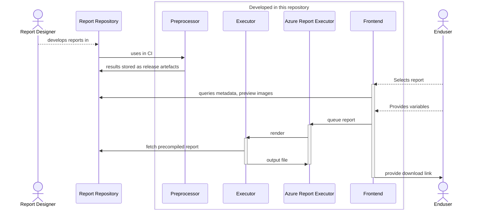

# Reports Engine

This project contains various code for a reporting engine on top of a database accessible through a web frontend. At the moment it supports Jasper reports only.

## Modules

### Executor
Java code to execute a report. Wrapper around Jasper Reports.

### Azure Report Executor
Wrapper around the Executor module to execute reports through Azure functions.

### Preprocessor
Java-based CLI application that takes report definitions and compiles them, creates documentation and more for humans and machine usage. It is designed to be part of a CI pipeline for report definitions.

See the documentation [here](preprocessor/README.md) for further information.

### Frontend

To Be Developed