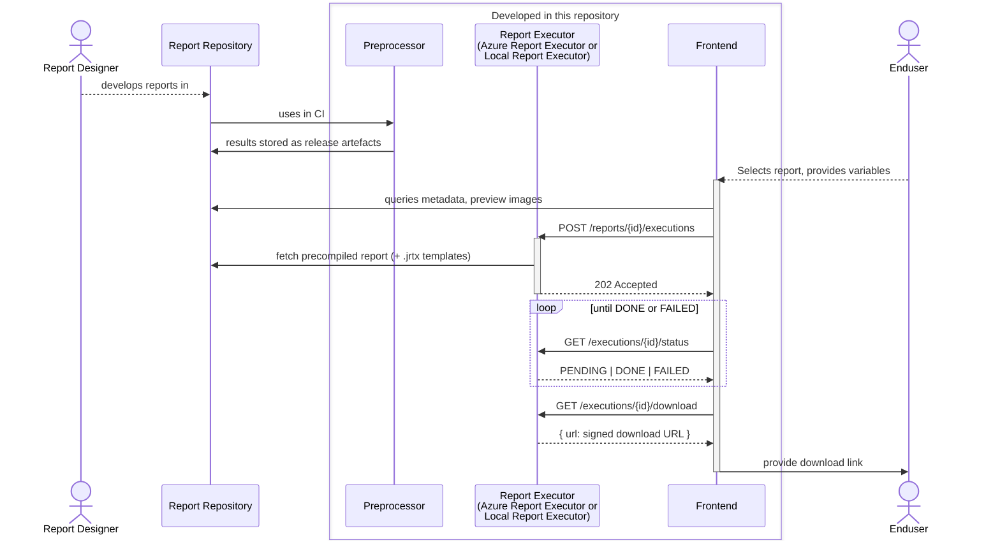

# Reports Engine

This project contains various code for a reporting engine on top of a database accessible through a web frontend. At the moment it supports Jasper reports only.

## Modules

Report execution is exposed as one HTTP API - trigger, poll status, download - implemented identically by two interchangeable deployments: **Azure Report Executor** (cloud, queue-backed) and **Local Report Executor** (Docker, self-hosted). The frontend talks to whichever one is configured via `REPORT_EXECUTION_API_URL`; it doesn't know or care which.

```mermaid
sequenceDiagram
    actor D as Report Designer
    participant Repo as Report Repository

    box Developed in this repository
        participant Preprocessor
        participant Exec as Report Executor<br/>(Azure Report Executor or<br/>Local Report Executor)
        participant Frontend
    end

    actor U as Enduser

    D-->>Repo: develops reports in
    Repo->>Preprocessor: uses in CI

    Preprocessor->>Repo: results stored as release artefacts

    U-->>Frontend: Selects report, provides variables
    activate Frontend
    Frontend->>Repo: queries metadata, preview images

    Frontend->>Exec: POST /reports/{id}/executions
    activate Exec
    Exec->>Repo: fetch precompiled report (+ .jrtx templates)
    Exec-->>Frontend: 202 Accepted
    deactivate Exec

    loop until DONE or FAILED
        Frontend->>Exec: GET /executions/{id}/status
        Exec-->>Frontend: PENDING | DONE | FAILED
    end

    Frontend->>Exec: GET /executions/{id}/download
    Exec-->>Frontend: { url: signed download URL }

    Frontend->>U: provide download link
    deactivate Frontend

``` 

### Executor
Java library that wraps Jasper Reports: loads a precompiled report via a pluggable `ReportLoader`, fills it against a JDBC connection, and exports the result. Not runnable on its own - consumed by both Azure Report Executor and Local Report Executor.

Resources a report references at fill time (a `<template>` pointing at a `.jrtx` style template, a custom font family's TTF files, an image) are resolved first from that report's own directory, then from a **shared assets directory** common to every report - in `mv_reports`, that's `reports/_shared/` (style template, fonts, logos live there; a report only needs its own copy of something to override the shared default). Both directories travel together in the same `reports.zip` release artifact, so Azure Report Executor gets both from one download.

#### Executor API trust model
Both executor deployments authenticate callers with a single shared secret - an Azure Functions
function key, or `EXECUTOR_API_KEY` for the Local Report Executor - rather than per-caller
identity. Anyone holding that key can trigger, poll, or download *any* execution, not just
one they created. This is only safe because the executor's HTTP API is assumed to sit behind
network isolation (private VNet/subnet, firewall rules, or a reverse proxy reachable only by
the frontend) - it must never be exposed directly on the public internet as if the shared
secret alone were sufficient protection.

### Azure Report Executor
Exposes the trigger/status/download HTTP API via Azure Functions HTTP triggers, and hands the actual fill off to a queue-triggered worker (`report-tasks` queue) so the HTTP call returns immediately. Fetches the reports bundle from the repository's released `reports.zip` (cached locally per function instance) and persists execution status/output in the function app's own storage account (Table Storage for status, Blob Storage for output, downloaded via short-lived SAS URLs).

### Local Report Executor
Docker-based, self-hosted equivalent of the Azure executor - same HTTP API, running as a standalone Javalin server instead of Azure Functions. Reports are read from a local/mounted directory (e.g. the preprocessor's own output) rather than fetched remotely, and execution status is kept in-memory for the life of the container (not durable across restarts). Intended for local development and self-hosted deployments that don't use Azure. See [docker-compose.yml](docker-compose.yml) for how it's wired into the dev stack.

### Preprocessor
Java-based CLI application that takes report definitions and compiles them, creates documentation and more for humans and machine usage. It is designed to be part of a CI pipeline for report definitions.

See the documentation [here](preprocessor/README.md) for further information.

### Frontend

TypeScript/Express web app for selecting reports, triggering execution, and downloading generated output, with OIDC login.
See [frontend/README.md](frontend/README.md) for details.

## Telemetry

Every component (executor, both report executors, frontend) emits an OpenTelemetry-based audit
log and usage-statistics metrics by default, plus opt-in distributed tracing across the whole
trigger → execute → download flow. See [TELEMETRY.md](TELEMETRY.md) for what's recorded and how
to configure it.

## Contributing

See [CONTRIBUTING.md](CONTRIBUTING.md) for how to set up a local dev environment and run the checks
used in CI.
