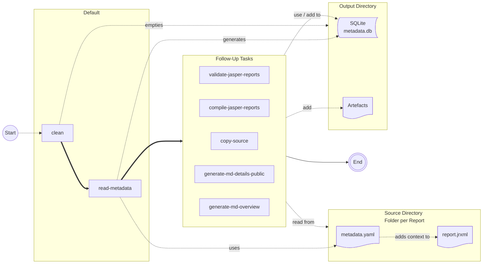

# Report Engine: Preprocessor

The preprocessor takes a directory of report definitions and outputs various overviews, documentation, precompiled reports,... for human and machine use. It is designed to be used during a CI/CD pipeline for reports.

## How does it work?

The proprocessor contains various tasks that read data from a source directory, process it and store data in an output directory. Here is an overview:



When calling the preprocessor on the CLI, you can specify 0..n tasks to be executed as arguments. 
When executing without any arguments, the default tasks (clean & read-metadata) are executed. 
If tasks are specified as arguments only those are executed. Before running any of the follow-up tasks, make sure read-metadata was executed.

The `--sourceDir` and `--outputBaseDir` along with task specific configuration options can be passed as options. Use `--help` to see available options.

## Input Structure

### Directory Structure

````
+ inputDir/
  + my_report_01/
    - metadata.yaml
    - report.jrxml (for Jasper Reports) 
````

### Metadata File

````yaml
id: member_table
title: List of Members (Table)
description: This report lists all active members with address and contact details. # optional
outputFormats: [xls, xlsx, csv]

complex: false # optional, default: false, Add warning to users that report requires extra attention due to its complexity.

# restrict report usage: (leave away for unrestricted access)
onlyWithRole: ["Administrator"]
onlyForType: ["Region","Local"]

# optional:
sql: |-
  SELECT * FROM members WHERE id = :group_id AND active = 1

parameter:
    - name: group_id
      label: Group
      description: ID of the group to create the report for
      comment: Is not displayed in the mask when the report is executed, but is automatically filled with the data of the current context.
      type: string
    - name: sample_minimal_parameter
      type: string

# optional:
additionalParameterDescription: |-
  Markdown formatted description to add more context about the parameters.

# optional:
versionHistory: 
    - version: 1.0
    - version: 1.1
      createdOn: 2021-10-15
      description: |-
        * Umstellung auf Style-Template
        * Feldnamen an GUI anpassen
        
      
````

# Usage

In the root directory of your reports repository, run:

````
docker run --rm -v $(pwd):/project reports-engine-preprocessor --help
````

Replace `--help` with your arguments.


## Build

From repository root:

````
mvn package -pl preprocessor
docker build ./preprocessor --tag reports-engine-preprocessor
````

# Tasks before committing

Check each command:
- Metadata
- Options
- functionality
Exception handling
